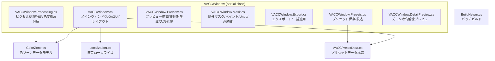

# VACC (VRC AvatarColorChanger) コードベース分析レポート

> 分析日: 2026-05-05

## 1. アーキテクチャ概要

本プロジェクトは **VRChat アバター用テクスチャの色変更を行う Unity エディタ拡張** です。
`VACCWindow : EditorWindow` を `partial class` で 8 ファイルに分割した構成になっています。

### ファイル構成

| ファイル | 役割 |
|----------|------|
| `VACCWindow.cs` | メインウィンドウ / OnGUI / レイアウト / ヘッダー |
| `VACCWindow.Processing.cs` | ピクセル処理 / HSV 色変換 / α分解（デコンタミネーション） |
| `VACCWindow.Preview.cs` | プレビュー描画 / 非同期生成 / 入力処理 / Diff |
| `VACCWindow.Mask.cs` | 除外マスク / ペイント / Undo / SessionState 永続化 |
| `VACCWindow.Export.cs` | エクスポート / 一括適用 |
| `VACCWindow.Presets.cs` | プリセット保存・読込 |
| `VACCWindow.DetailPreview.cs` | ズーム時高解像度プレビュー |
| `ColorZone.cs` | 色ゾーンデータモデル / HSV マッチングロジック |
| `VACCPresetData.cs` | プリセットデータ構造 |
| `Localization.cs` | 日英ローカライズ |
| `BuildHelper.cs` | バッチビルド（unitypackage エクスポート用） |

### 処理フロー

```
ユーザーがテクスチャ選択
  → ColorZone で色範囲を指定（ColorPick / Rect / FloodFill）
  → プレビュー: 非同期 Task.Run + Parallel.For でバックグラウンド生成
  → マスク: SessionState + Base64 bitpack で永続化
  → エクスポート: ディスクから直接 PNG 読み込み → フル解像度処理 → 書き出し
```

### アーキテクチャ図



---

## 2. 優れた実装ポイント

全体的にピクセル処理アルゴリズム自体は非常に高度でよく作り込まれています。

- **HSV 色空間マッチング**: 色相・彩度・明度を分離した高精度な色検出
- **α分解によるデコンタミネーション**: AA 境界での halo（薄汚れた中間色）を構造的に除去
- **FloodFill**: シード点からの連続領域抽出（エッジストッパー付き）
- **ハイライト復元**: 鏡面反射で白飛びした領域を空間伝播で回収
- **非同期プレビュー生成**: デバウンス付きでメインスレッドをブロックしない設計意図
- **ArrayPool 活用**: ヒープアロケーションを抑えたメモリ効率の良い実装
- **BoxFilterSum**: O(N) のスライディングウィンドウによる高速ボックスフィルタ

---

## 3. Unity エディタ拡張としての問題点

### 🔴 重大度: 高

#### 3.1 メインスレッドを `Task.Run().Wait()` でブロック

**該当箇所**: `VACCWindow.Export.cs` L144, L296

重いピクセル処理を `Task.Run` でバックグラウンド実行した後、**メインスレッドで `.Wait()` している**ため、処理中は Unity Editor 全体が完全にフリーズします。

```csharp
// 問題のパターン
var task = System.Threading.Tasks.Task.Run(() =>
    ProcessPixelsArray(pixels, texW, texH, ...));
task.Wait(); // ← メインスレッドがブロックされる
```

**改善案**:
- `async/await` パターンに変更
- `EditorApplication.update` でのポーリングによる進行管理
- または `EditorCoroutine` 的な進行管理に変更

---

#### 3.2 `OnGUI` 内での `DestroyImmediate` 呼び出し

**該当箇所**: `VACCWindow.Preview.cs` (`ApplyPendingPreview()`, `ApplyPendingDetailPreview()`)

`OnGUI` の Layout/Repaint イベント中に `DestroyImmediate` が呼ばれています。これは IMGUI のコントロール ID 整合性を壊す可能性があります。

```csharp
// OnGUI 経由で呼ばれる
if (previewTexture != null) DestroyImmediate(previewTexture); // ← OnGUI 中に危険
```

**改善案**:
- `EditorApplication.delayCall` で遅延破棄する
- または `Destroy()` を使用する（即時破棄を避ける）

---

#### 3.3 バックグラウンドスレッドからの Unity API 呼び出し

**該当箇所**: `VACCWindow.Preview.cs` L680, `VACCWindow.DetailPreview.cs` L150

```csharp
// Task.Run の finally 内（非 UI スレッド）
_previewGenerating = false;
UnityEditor.EditorApplication.delayCall += Repaint; // ← 非 UI スレッドから
```

`Repaint` は `EditorWindow` のインスタンスメソッドであり、Unity の API は基本的にメインスレッドからの呼び出しを前提としています。`delayCall` 自体はスレッドセーフですが、キャプチャしている `Repaint` デリゲートの呼び出しタイミングによっては問題が生じる可能性があります。

**改善案**:
- `delayCall` に登録するデリゲート内でメインスレッドであることを確認する
- `SynchronizationContext` を利用してメインスレッドにディスパッチする

---

#### 3.4 `volatile` 多用による擬似的スレッド安全性

**該当箇所**: `VACCWindow.Preview.cs` L20-L24

```csharp
private volatile bool _previewGenerating;
private volatile bool _asyncCancelled;
private volatile int _asyncGeneration;
```

複数の `volatile` 変数を組み合わせた条件判断はアトミックではありません。

```csharp
// この判定はアトミックではない
if (myGen != _asyncGeneration || _asyncCancelled)
    return;
```

例えば `_asyncGeneration` を読み取った直後に別スレッドが `_asyncCancelled` を変更する可能性があります。

**改善案**:
- `lock` ステートメントを使用する
- `Interlocked.CompareExchange` を使用する
- `CancellationTokenSource` を単一の同期ポイントとして使う（すでに `_previewCts` があるため、`_asyncCancelled` は `_previewCts.IsCancellationRequested` で代替可能）

---

### 🟡 重大度: 中

#### 3.5 Unity Undo システム未統合

**該当箇所**: `VACCWindow.Mask.cs` L420-L470

マスク編集に独自の Undo スタック（`_undoMaskHistory`、最大 30 ステップ）を実装していますが、Unity 標準の `Undo.RecordObject` を使っていません。

**影響**:
- Ctrl+Z が Unity のグローバル Undo と統合されない
- シーンに保存されないため、シーン再読み込みで Undo 履歴が消える
- ユーザーが Unity 標準の Undo 操作と異なる挙動に混乱する

**改善案**:
- `Undo.RecordObject(this, "Mask Paint")` で Unity Undo に統合
- または `Undo.RegisterCompleteObjectUndo` を使用

---

#### 3.6 `SessionState` に大容量データを保存

**該当箇所**: `VACCWindow.Mask.cs` L500-L600

マスクを Base64 bitpack で `SessionState.SetString` に保存しています。

| テクスチャ解像度 | マスクサイズ（bool配列） | Base64 後サイズ |
|-----------------|------------------------|----------------|
| 1024×1024 | 1 MB | 約 1.4 MB |
| 2048×2048 | 4 MB | 約 5.3 MB |
| 4096×4096 | 16 MB | 約 21.3 MB |

`SessionState` は .NET の `Dictionary<string, string>` 相当で、大容量データの保存には適していません。また、ゾーン別マスクが複数ある場合はさらに増大します。

**改善案**:
- 大きなマスクは一時ファイル（`Application.temporaryCachePath`）に保存
- または `ScriptableObject` としてアセット保存
- どうしても SessionState を使う場合は、Run-Length Encoding (RLE) などで圧縮する

---

#### 3.7 `Handles` API を `EditorWindow.OnGUI` 内で使用

**該当箇所**: `VACCWindow.Preview.cs` L430

```csharp
Handles.DrawSolidDisc(e.mousePosition, Vector3.forward, brushPixels * 0.5f);
```

`Handles` クラスは `SceneView.OnSceneGUI` での使用を想定しており、3D ワールド座標系で動作します。`EditorWindow` の `OnGUI` 内で使うと、GUI クリッピングや行列の不整合が発生する可能性があります。

**改善案**:
- `EditorGUI.DrawRect` で円形近似描画
- `GUI.DrawTexture` でブラシカーソル用テクスチャを描画

---

#### 3.8 `CloneZone` の手動メンテナンスリスク

**該当箇所**: `VACCWindow.Preview.cs` L750-L770

```csharp
// 注意: 新しいフィールドをColorZoneに追加した場合はここも更新すること。
private static ColorZone CloneZone(ColorZone z) => new ColorZone
{
    id = z.id, name = z.name, enabled = z.enabled, ...
};
```

コメントにもある通り、`ColorZone` にフィールドを追加するたびにこのメソッドも更新する必要があり、コピー漏れがプレビューと本処理の結果不一致を引き起こします。

**改善案**:
- `System.Text.Json` によるシリアライズ/デシリアライズ
- `ICloneable` インターフェースの実装
- ソースジェネレーターによる自動生成

---

#### 3.9 `package.json` の JSON 破損

**該当箇所**: `package.json` L22-L23

```json
"dependencies":  {
                 },
        "url":  "https://...",
```

`dependencies` ブロックの閉じ括弧の後、インデントが崩れた `"url"` キーが重複して存在しています。これは UPM (Unity Package Manager) がパッケージを正しく解決できない原因になります。

**改善案**:
- 重複した `"url"` キーを削除する
- JSON のインデントを整形する

---

### 🟢 重大度: 低

#### 3.10 `partial class` の過剰分割

8 ファイルに分割されていますが、すべてが `VACCWindow` の部分クラスです。状態のライフサイクル把握が難しく、密結合になっています。

**改善案**:
- マスクロジック → `MaskManager` クラスに抽出
- プレビュー生成 → `PreviewRenderer` クラスに抽出
- エクスポート → `TextureExporter` クラスに抽出

---

#### 3.11 `ArrayPool` の Rent/Return パス漏れリスク

ほとんどの箇所で `try/finally` が使われていますが、`Rent` と `try` の間で例外が発生した場合にリークする可能性があります。

```csharp
float[] pixH = ArrayPool<float>.Shared.Rent(len);
// この間で例外が発生すると Return されない
try { ... }
finally { ArrayPool<float>.Shared.Return(pixH); }
```

**改善案**:
- `Rent` の直後に `try` を開始する（すでに多くの箇所で対応済み）
- 未対応箇所の修正

---

#### 3.12 `Parallel.For` のスレッドプール圧迫

`Parallel.For` はデフォルトで全 CPU コアを使用します。Unity Editor はすでに多くのスレッドを使用しているため、`MaxDegreeOfParallelism` を制限する方が安全です。

**改善案**:
```csharp
var po = new ParallelOptions
{
    MaxDegreeOfParallelism = Math.Max(1, Environment.ProcessorCount - 2),
    CancellationToken = cancellationToken
};
```

---

## 4. 改善優先度マトリクス

| 優先度 | 問題 | 影響 | 修正難易度 |
|--------|------|------|-----------|
| 🔴 高 | `Task.Run().Wait()` でメインスレッドブロック | エディタがフリーズ | 中 |
| 🔴 高 | `OnGUI` 内 `DestroyImmediate` | IMGUI 整合性破壊 | 低 |
| 🔴 高 | バックグラウンドスレッドからの Unity API 呼び出し | クラッシュリスク | 低 |
| 🔴 高 | `volatile` のみのスレッド同期 | レースコンディション | 中 |
| 🟡 中 | Unity Undo 未統合 | ユーザー体験の低下 | 中 |
| 🟡 中 | `SessionState` 大容量保存 | パフォーマンス低下 | 中 |
| 🟡 中 | `Handles` の誤用 | 描画不整合 | 低 |
| 🟡 中 | `CloneZone` 手動メンテ | バグの温床 | 低 |
| 🟡 中 | `package.json` 破損 | UPM 解決失敗 | 低 |
| 🟢 低 | 過剰な partial class | 保守性低下 | 高 |
| 🟢 低 | `ArrayPool` パス漏れ | メモリリーク | 低 |
| 🟢 低 | `Parallel.For` スレッドプール圧迫 | パフォーマンス | 低 |

---

## 5. 総評

ピクセル処理アルゴリズム自体（HSV 色空間マッチング、α分解によるデコンタミネーション、FloodFill、ハイライト復元）は非常に高度でよく作り込まれています。

問題の多くは「**Unity Editor の API を正しいコンテキストで使う**」という点に集中しており、特に **スレッド管理とメインスレッドブロッキング** が最大の改善ポイントです。

短期的には以下の 3 点から着手することを推奨します：

1. **`Task.Run().Wait()` の排除** → エディタのフリーズを解消
2. **`OnGUI` 内の `DestroyImmediate` 排除** → IMGUI の安定性向上
3. **`package.json` の修正** → UPM パッケージ解決の正常化
